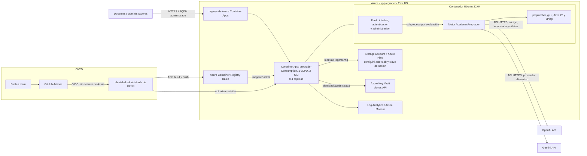

# Arquitectura y costos de AcademicPregrader

Estimación elaborada el **11 de agosto de 2026**, basada en la infraestructura y la configuración versionadas en este repositorio. Los valores están expresados en USD, con precios públicos de referencia para East US y sin impuestos, descuentos institucionales ni conversión a moneda local.

## Diagrama de arquitectura

## Flujo de una evaluación

1. El docente inicia sesión y carga el ZIP de entregas y el PDF del enunciado.
2. Flask guarda la carga en almacenamiento temporal y ejecuta el motor como subproceso.
3. El motor extrae el PDF, compila cada entrega con `g++` y compara similitud con JPlag.
4. Por cada estudiante, envía código, enunciado y rúbrica al proveedor LLM seleccionado.
5. La interfaz recibe el avance mediante Server-Sent Events y genera el resultado descargable.
6. Los temporales del trabajo se eliminan; configuración, usuarios y auditoría persisten en Azure Files.

## Tabla de costos de infraestructura

| Componente | Configuración | Forma de cobro | Estimado mensual |
|---|---|---:|---:|
| Azure Container Apps | Consumption, 1 vCPU, 2 GiB, mínimo 0 y máximo 1 | Primeros 180.000 vCPU-s y 360.000 GiB-s gratis; luego aprox. US$0,108 por hora activa | US$0 con hasta 50 h activas; luego variable |
| Azure Container Registry | Basic | Aproximadamente US$0,167 por día | **US$5,00** |
| Azure Files | Standard LRS, recurso compartido de hasta 1 GiB | US$0,06 por GiB usado, más operaciones | **US$0,06-0,15** |
| Azure Key Vault | Standard | US$0,03 por 10.000 operaciones | **US$0,00-0,03** |
| Log Analytics / Azure Monitor | Logs del entorno de Container Apps | Depende del volumen de ingestión y retención | **US$0 en uso bajo; variable** |
| Identidades administradas y OIDC | Una identidad del contenedor y una de CI/CD | Sin cargo directo | **US$0** |
| Ingress HTTPS y certificado del FQDN de Azure | Administrado por Container Apps | Sin cargo fijo adicional | **US$0** |
| GitHub Actions | Un build y despliegue por cambio en `main` | Incluido según cuota del plan; ACR Tasks puede generar un cargo pequeño por build | **US$0 o variable** |
| OpenAI o Gemini | Una llamada por estudiante, más reintentos | Tokens de entrada y salida | **Variable; no incluido en Azure** |

El costo base esperable, sin evaluaciones y con la aplicación escalada a cero, es de aproximadamente **US$5,10 al mes**. ACR Basic representa casi todo ese valor.

## Escenarios mensuales

La capacidad configurada consume simultáneamente 1 vCPU y 2 GiB. Por eso, ambas franquicias gratuitas de Container Apps equivalen a unas 50 horas activas al mes.

| Escenario | Horas activas al mes | Container Apps | Otros costos base | Total de infraestructura* |
|---|---:|---:|---:|---:|
| Bajo | 20 h | US$0,00 | US$5,10 | **US$5,10** |
| Medio | 100 h | US$5,40 | US$5,10 | **US$10,50** |
| Intensivo | 300 h | US$27,00 | US$5,10 | **US$32,10** |

\* No incluye consumo del LLM, salida de datos extraordinaria, ingestión elevada de logs ni builds frecuentes. Las horas activas incluyen procesamiento y el tiempo que cada réplica permanece encendida antes de volver a cero.

## Costo estimado del LLM

El costo real depende principalmente del tamaño del código, el PDF y la respuesta. Como referencia, se supone por estudiante una solicitud de **10.000 tokens de entrada** y **1.000 tokens de salida**, sin reintentos.

| Modelo de referencia | Entrada / 1M tokens | Salida / 1M tokens | Por estudiante | Curso de 30 estudiantes |
|---|---:|---:|---:|---:|
| GPT-4o | US$2,50 | US$10,00 | **US$0,0350** | **US$1,05** |
| Gemini 2.5 Flash | US$0,30 | US$2,50 | **US$0,0055** | **US$0,17** |
| Gemini 2.5 Pro | US$1,25 | US$10,00 | **US$0,0225** | **US$0,68** |

Fórmula aplicable a cualquier modelo:

$$
C_{LLM} = \frac{T_{entrada}}{1.000.000} P_{entrada} + \frac{T_{salida}}{1.000.000} P_{salida}
$$

Para estimar un curso completo, se multiplica el resultado por la cantidad de estudiantes y por el número de ejecuciones que no reutilicen caché. En la configuración actual, `enable_cache = false`, por lo que repetir una evaluación vuelve a consumir tokens.

## Observaciones importantes

- No hay PostgreSQL en el despliegue versionado. Al no definirse `PREGRADER_DB_URL`, la aplicación usa SQLite en `users.db`, persistido en Azure Files.
- No hay zona Azure DNS ni dominio personalizado definidos en el repositorio; el acceso usa el FQDN HTTPS administrado por Container Apps.
- `gemini-2.0-flash` todavía aparece como opción recomendada en la interfaz, pero Google lo retiró el 1 de junio de 2026. Debe cambiarse a un modelo vigente, por ejemplo `gemini-2.5-flash`.
- El máximo de una réplica evita escrituras SQLite concurrentes entre instancias, pero también limita la capacidad a una evaluación intensiva a la vez.
- Para obtener el gasto real, se debe contrastar esta estimación con Azure Cost Management y los paneles de uso de OpenAI o Google AI Studio.

## Fuentes de precios

- [Azure Container Apps](https://azure.microsoft.com/pricing/details/container-apps/)
- [Azure Container Registry](https://azure.microsoft.com/pricing/details/container-registry/)
- [Azure Files](https://azure.microsoft.com/pricing/details/storage/files/)
- [Azure Key Vault](https://azure.microsoft.com/pricing/details/key-vault/)
- [OpenAI API](https://openai.com/api/pricing/)
- [Gemini API](https://ai.google.dev/gemini-api/docs/pricing)